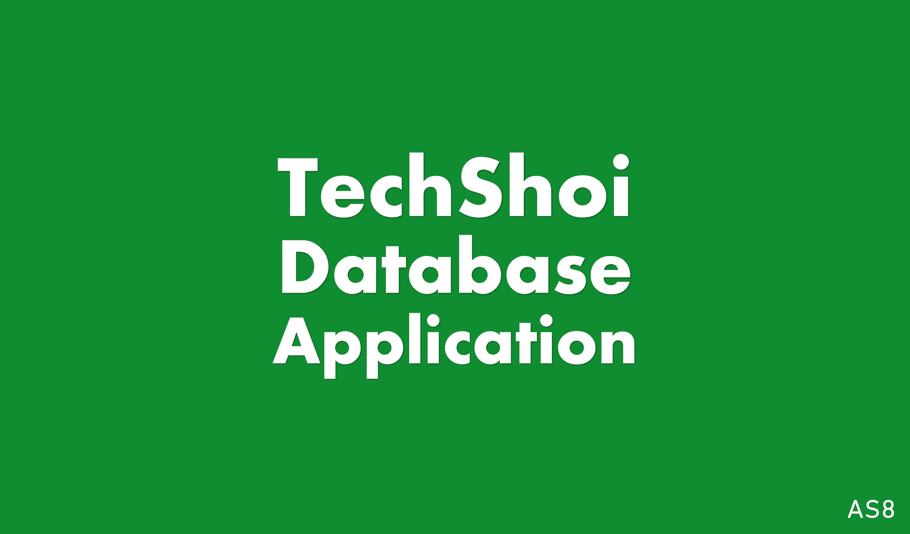

# TechShoi-Database-Application
🎯 A web-based application for TechShoi's database management, automation, and analytical report generation.

 

## What is TechShoi?
TechShoi is an Eco-friendly products-based E-commerce site that offers sustainable and Eco-friendly products to consumers to free ourselves from the danger of plastic pollution for the betterment of our lifestyle and health. Switching to sustainable products only can do good for us and solve the plastic harmfulness from our life.
Eco-friendly and sustainable products are made of natural resources like the daily commodities made of bamboo, earthen product, goods made of stainless steel, wood and others which are totally Biodegradable, recyclable and reusable. 

Visit TechShoi's official website: https://techshoibd.com/

 

## About the Database Application
Maintaining a resourceful database is nowadays crucial for the development of an organization. But only database management isn't sufficient for that purpose. We need to represent them with proper analytics. There is so much going on in the background of such operations. That's why TechShoi took the initiative of creating a database management application that will help them to achieve their goals.

 

## Credits
*Ahammad Shawki* (@ahammadshawki8) - Designed the entire database management plan and implemented them to materialize the initial backbone of this application.